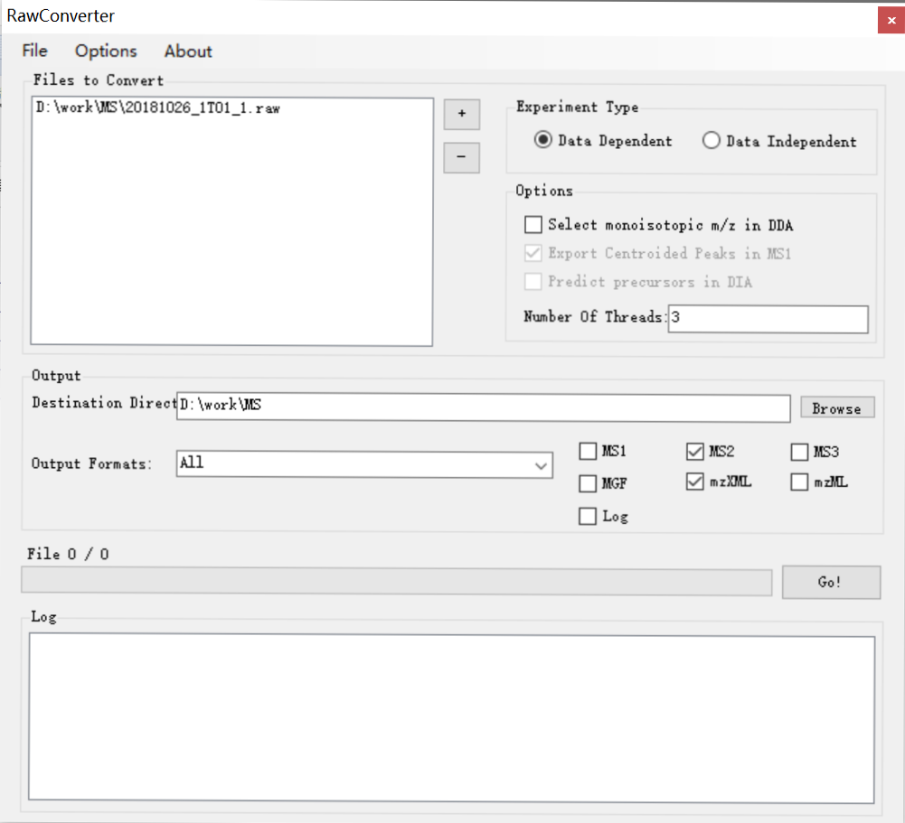
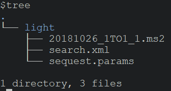
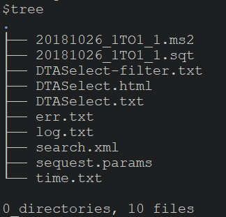
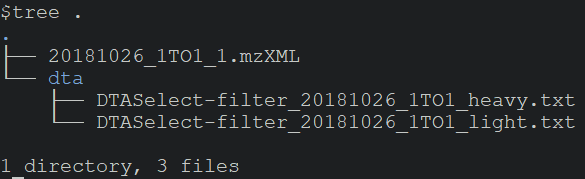
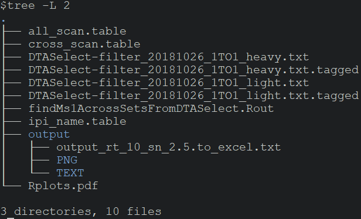
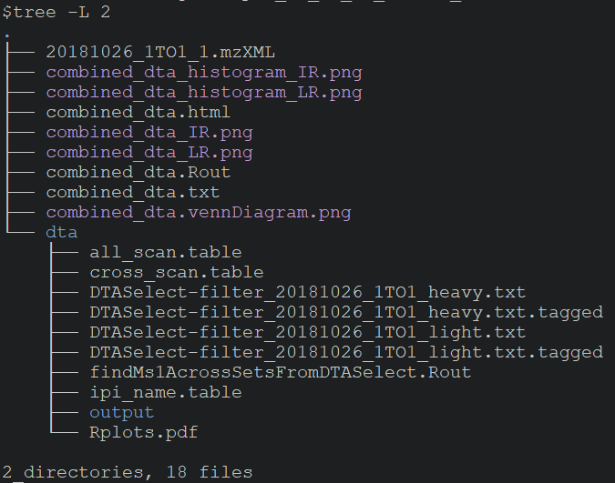

# Pipeline with ProLuCID

Download [ProLuCID](http://fields.scripps.edu/yates/wp/?page_id=821)

Convert raw file to **ms2** and **mzXML** with [Rawconverter](http://fields.scripps.edu/rawconv/)




## 1. Identification

Copy or link ms2 file into light and heavy directory, search with light or heavy params



```bash
java -Xmx4G -jar /path/of/ProLuCID1_3.jar 20181026_1TO1_1.ms2 search.xml 4
```

Run DTASelect for FDR control of the resulting sqt file

```bash
DTASelect --trpstat --modstat -p 1 -y 2 -m 0 -l Keratin --fp 0.01
```




## 2. Preparation of input file

Copy the two DTASelect-filter.txt files into "dta" folder which is located at the same level of 20181026_1TO1_1.mzXML

```bash
mkdir dta
cp /path/of/light/DTASelect-filter.txt dta/DTASelect-filter_20181026_1TO1_light.txt
cp /path/of/heavy/DTASelect-filter.txt dta/DTASelect-filter_20181026_1TO1_heavy.txt
```



## 3. Quantification with CIMAGE

Then execute CIMAGE in the "dta" folder, and generate html for visualization

```bash
cd dta
cimage /path/of/cimage.params.IAtev 20181026_1TO1
```



```bash
cd ..
cimage_combine dta
```




